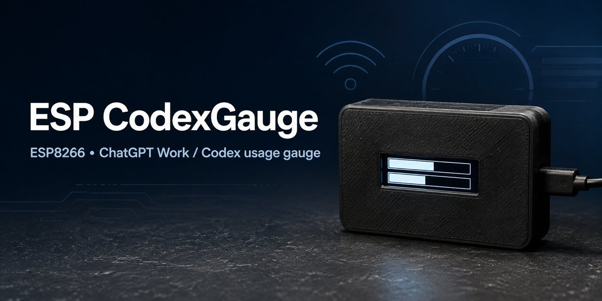
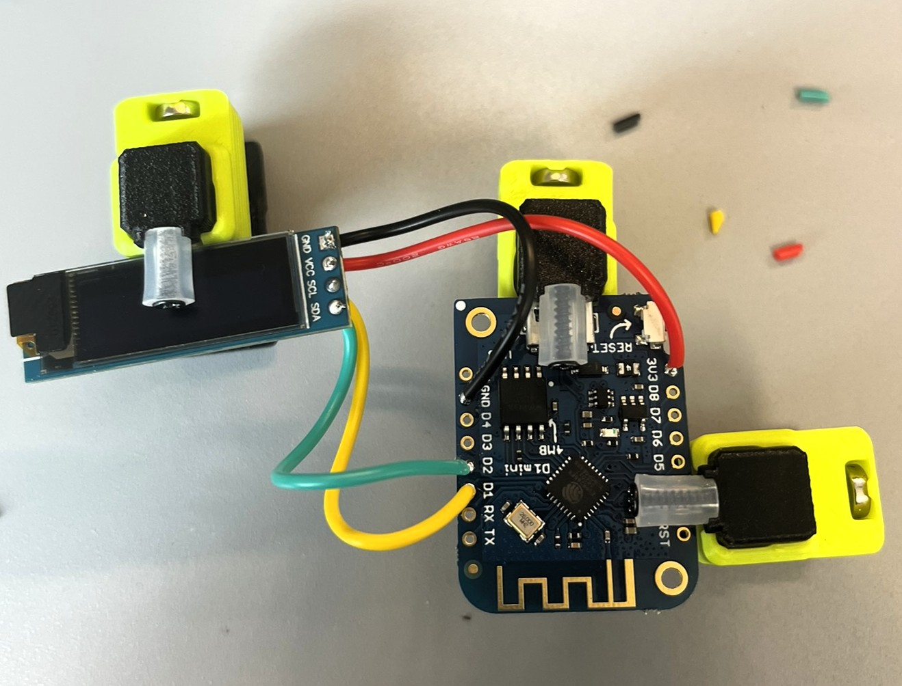
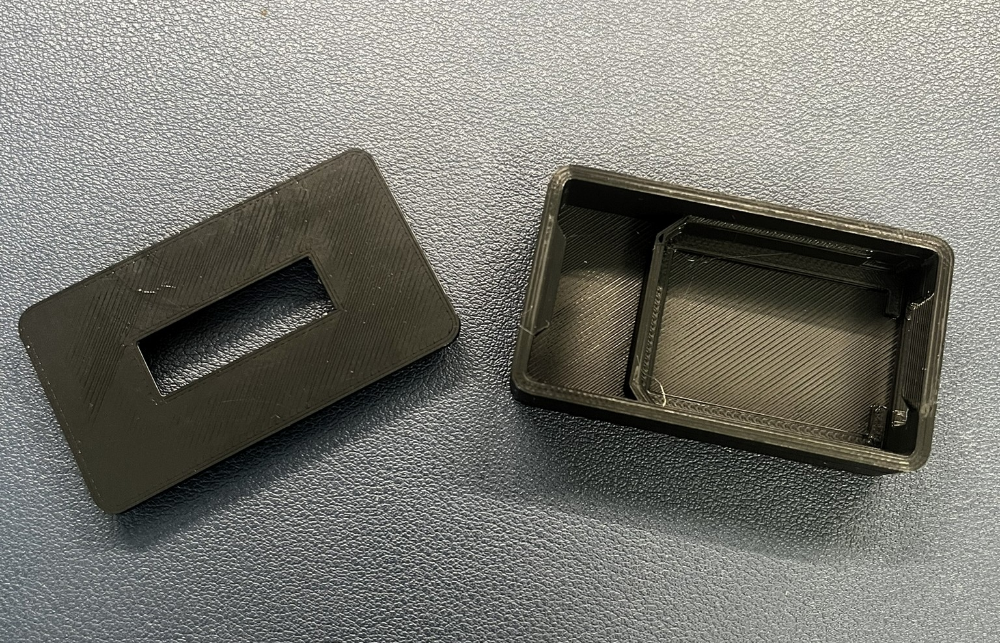
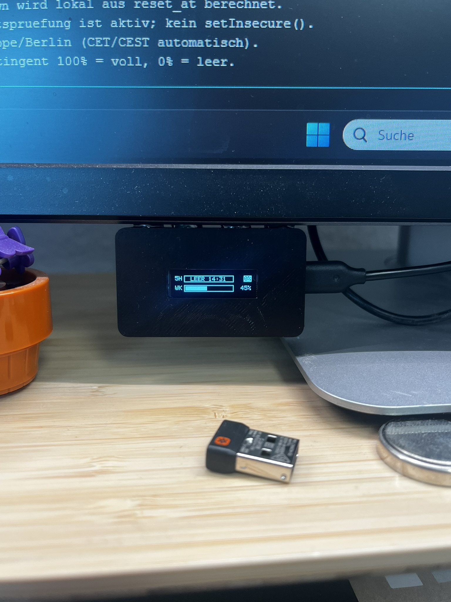
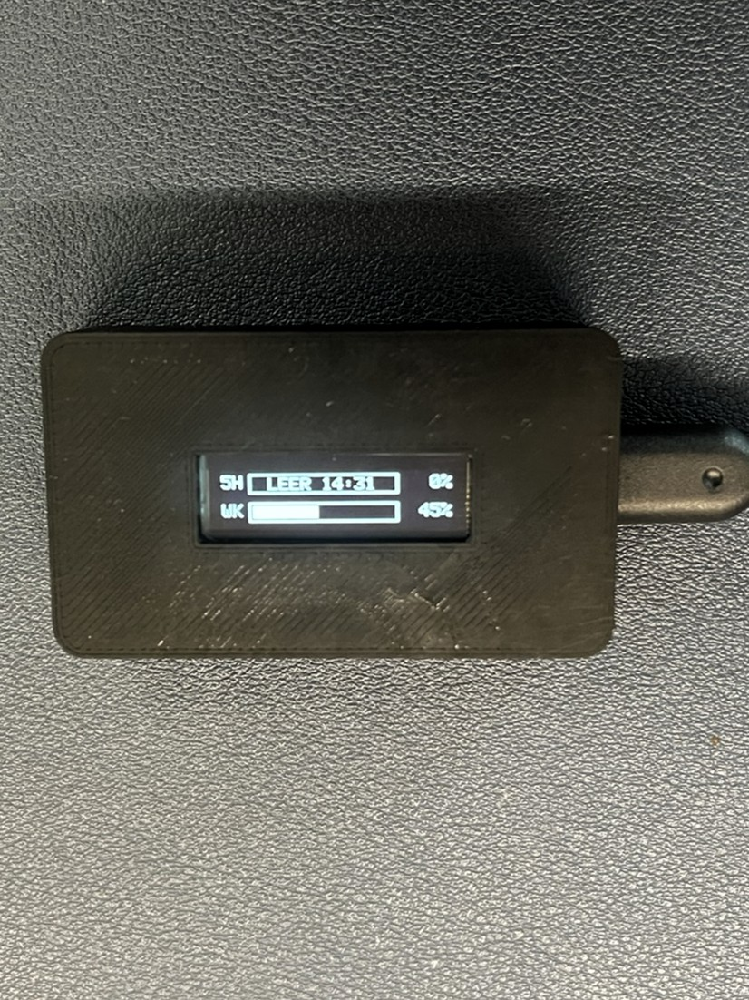

# ESP CodexGauge

**A standalone ESP8266 OLED fuel gauge for ChatGPT Work / Codex usage limits.**

[](https://github.com/TeeVau/ESP-CodexGauge/actions/workflows/compile.yml)
[](https://github.com/TeeVau/ESP-CodexGauge/releases)
[](LICENSE)

> ESP CodexGauge displays the remaining 5-hour and weekly usage windows on a small SSD1306 OLED. It authenticates directly from the ESP8266 using the OpenAI device-login flow and needs no computer, server, proxy, API key, or browser automation after the initial login.

**Firmware:** `0.8.3` (experimental public release)<br>
**Platform:** ESP8266 / Wemos D1 mini<br>
**License:** MIT



_A compact ESP8266 maker project for monitoring ChatGPT Work / Codex usage windows._

The documented public release is **v0.8.3**. It includes reset-aware usage polling,
automatic authentication recovery, persistent LittleFS credentials, and the
maker documentation in this repository. See the [changelog](CHANGELOG.md) for
the firmware history.

## What it does

The display behaves like a fuel gauge:

- `100%` means the complete quota is still available.
- `0%` means the quota is exhausted.
- `5H` shows the current five-hour window.
- `WK` shows the weekly window.
- Empty windows show their next reset time when the backend provides one.
- The last valid value remains visible during temporary network or API failures, but stale data is marked.

The firmware polls usage every five minutes and performs one extra request 30 seconds after a known reset. Reset countdowns are calculated locally from the returned `reset_at` timestamps.

## Important compatibility notice

This project uses an **undocumented ChatGPT/Codex backend endpoint**. The endpoint, response format, authentication requirements, rate limits, or certificate chain may change without notice. The displayed quota is for the relevant ChatGPT Work / Codex usage windows; it is not a meter for normal ChatGPT conversations or OpenAI API billing.

ESP CodexGauge is an independent community project and is not affiliated with, endorsed by, or supported by OpenAI. OpenAI, ChatGPT, and Codex are trademarks of their respective owners.

## Features

- Direct OpenAI device OAuth from the ESP8266
- Persistent LittleFS refresh token with refresh-token rotation
- TLS 1.2 with X.509 certificate verification
- Automatic Wi-Fi reconnect and network/DNS readiness checks
- Automatic access-token refresh and device-login recovery
- 5-hour and weekly remaining-quota gauges on a 128×32 OLED
- Europe/Berlin CET/CEST timezone handling by default
- Serial-only operation if the OLED is missing or not detected
- Stale-data indication instead of silently displaying `0%`

## Hardware

| Part | Quantity | Notes |
|---|---:|---|
| Wemos D1 mini V3.0.0 | 1 | ESP8266 controller |
| 0.91-inch SSD1306 OLED | 1 | 128×32 pixels, I²C; optional for Serial-only operation |
| USB power supply and cable | 1 | 5 V USB input to the D1 mini |
| Enclosure | optional | A compatible 3D-printable enclosure is linked below |

### Wiring



The photo shows the OLED connected directly to the Wemos D1 mini. Use the pin table below as the authoritative wiring reference.

| OLED pin | Wemos D1 mini | ESP8266 GPIO |
|---|---|---:|
| GND | G | — |
| VCC | 3V3 | — |
| SCL | D1 | GPIO5 |
| SDA | D2 | GPIO4 |

The firmware checks I²C addresses `0x3C` and `0x3D` automatically. See the detailed [wiring guide](docs/WIRING.md).

A compatible enclosure is available on [Thingiverse](https://www.thingiverse.com/thing:3811240).





_The completed gauge running beside a development computer._

## Software requirements

- [Arduino IDE 2](https://www.arduino.cc/en/software), or Arduino CLI
- ESP8266 Arduino Core 3.x
- ArduinoJson 6.x
- [Adafruit GFX Library](https://github.com/adafruit/Adafruit-GFX-Library)
- [Adafruit SSD1306](https://github.com/adafruit/Adafruit_SSD1306)
- LittleFS from the ESP8266 Arduino Core

The ESP8266 connects to 2.4 GHz Wi-Fi. A 5 GHz-only network is not supported.

Recommended Arduino IDE settings:

| Setting | Value |
|---|---|
| Board | `LOLIN(WEMOS) D1 R2 & mini` |
| CPU Frequency | `160 MHz` |
| Flash size | `4 MB with LittleFS` |
| Serial Monitor | `115200 baud` |

## Installation with Arduino IDE

### 1. Install board support

1. Install [Arduino IDE 2](https://www.arduino.cc/en/software).
2. Open **File → Preferences**.
3. Add this URL to **Additional Boards Manager URLs**:

   ```text
   https://arduino.esp8266.com/stable/package_esp8266com_index.json
   ```

4. Open **Tools → Board → Boards Manager**, search for `esp8266`, and install the ESP8266 community package.
5. Select **Tools → Board → ESP8266 Boards → LOLIN(WEMOS) D1 R2 & mini**.
6. Select the settings listed above, especially `4 MB with LittleFS`.

### 2. Install libraries

Open **Sketch → Include Library → Manage Libraries** and install:

- `ArduinoJson` version 6.x
- `Adafruit GFX Library`
- `Adafruit SSD1306`

### 3. Configure Wi-Fi

Copy `src/secrets.example.h` to `src/secrets.h` and replace the placeholders:

```cpp
#pragma once

constexpr char WIFI_SSID[] = "your-wifi-name";
constexpr char WIFI_PASSWORD[] = "your-wifi-password";
```

`secrets.h` is intentionally ignored by Git. Never commit it.

### 4. Compile and upload

1. Open `src/ESP-CodexGauge.ino` in Arduino IDE.
2. Select the Wemos D1 mini board and the correct USB port.
3. Click **Verify**.
4. Click **Upload**.
5. Open **Tools → Serial Monitor** at `115200 baud`.

The matching command-line board identifier is:

```text
esp8266:esp8266:d1_mini
```

## First login

On the first boot, the device has no stored OpenAI authentication:

1. Wait for the device to connect to Wi-Fi and synchronize time with NTP.
2. Open the URL shown in the Serial Monitor, normally:

   <https://auth.openai.com/codex/device>

3. Sign in with the ChatGPT account that should be monitored.
4. Enter the device code shown on the OLED or in the Serial Monitor.
5. Wait for the OAuth exchange to complete.
6. The refresh token and account ID are stored in LittleFS on the ESP8266.

The device polls for authorization for up to 15 minutes. After a successful login, later reboots use the stored refresh token and do not require another browser login unless the token is revoked or expires.

The OLED shows `OPENAI / AUTH OK` until the first successful usage request completes. The normal `5H` and `WK` gauges then replace it.

For the complete authentication and relogin behavior, see [docs/AUTHENTICATION.md](docs/AUTHENTICATION.md).

## Display and runtime behavior



Normal display example:

```text
5H [██████████      ]  60%
WK [█████████       ]  54%
```

When a quota is empty, the reset is shown inside the tank:

```text
5H [LEER 14:31           ]   0%
WK [LEER DI 16:29        ]   0%
```

- The filled tank is the **remaining** quota, not the consumed quota.
- At 25% or below, the percentage is inverted as a warning.
- At 10% or below, the percentage blinks between normal and inverted display.
- If no successful usage response has ever arrived, the OLED shows `OPENAI / warte auf Daten`.
- If the last successful response is older than 15 minutes, the known values remain visible and the `5H`/`WK` labels are inverted to indicate stale data.

The important distinction is that an empty quota is a valid result: `0%` is
shown with `LEER` and the known reset time. Missing data is shown as `--%`,
while an older but valid result keeps its value and marks the labels as stale.

Usage is normally refreshed every five minutes. A known reset triggers one additional refresh 30 seconds later, after which the regular five-minute interval starts again.

## Security and privacy

- TLS certificate verification is enabled; the firmware does not use `setInsecure()`.
- The access token exists only in RAM.
- The refresh token and ChatGPT account ID are stored as plaintext in ESP8266 flash through LittleFS.
- Anyone who can physically dump the flash should be treated as trusted.
- Do not share Serial Monitor output containing account IDs, email addresses, OAuth tokens, refresh tokens, or device-login codes.
- Wi-Fi credentials belong only in the ignored local `secrets.h` file.

Read [SECURITY.md](SECURITY.md) before publishing logs or opening an issue.

## Troubleshooting

| Symptom | First checks |
|---|---|
| `secrets.h` missing during compile | Copy `secrets.example.h` to `secrets.h`; do not rename the variables. |
| OLED is blank | Check 3V3/GND, SDA on D2, SCL on D1, and addresses `0x3C`/`0x3D`. |
| WLAN timeout | Check the SSID/password, 2.4 GHz availability, signal strength, and USB power. |
| NTP or TLS failure | Keep the device online; certificate validation requires a valid system time. |
| Device login fails | Use the current URL and code, keep the Serial Monitor open, and retry after checking DNS/network access. |
| Stored login stops working | Set `FORCE_RELOGIN` to `true`, flash once, complete login, then set it back to `false`. |
| Display remains unchanged | Check whether the Serial Monitor reports a temporary HTTP/API error or stale data. |
| Quota does not change immediately after reset | The firmware waits 30 seconds after `reset_at` before its special refresh. |

See the expanded [troubleshooting guide](docs/TROUBLESHOOTING.md) before opening an issue.

## Debugging options

Release defaults are intentionally quiet:

```cpp
constexpr bool DEBUG_HEAP = false;
constexpr bool DEBUG_HTTP = false;
```

Set these flags to `true` only while diagnosing a problem. Never publish HTTP response bodies or logs containing credentials or account information.

## Project structure

```text
ESP-CodexGauge/
├── src/
│   ├── ESP-CodexGauge.ino
│   └── secrets.example.h
├── assets/
│   ├── display.jpg
│   ├── enclosure-parts.jpg
│   ├── github-social-preview.jpg
│   ├── project-in-use.jpg
│   └── wiring.jpg
├── README.md
├── CHANGELOG.md
├── LICENSE
├── CONTRIBUTING.md
├── SECURITY.md
├── docs/
│   ├── AUTHENTICATION.md
│   ├── TROUBLESHOOTING.md
│   └── WIRING.md
└── .github/
    ├── ISSUE_TEMPLATE/bug_report.md
    └── workflows/compile.yml
```

## Contributing

Bug reports, wiring corrections, compatibility reports, and documentation improvements are welcome. Read [CONTRIBUTING.md](CONTRIBUTING.md) first. Hardware and authentication reports must redact all credentials, tokens, account IDs, and device codes.

## License

This project is licensed under the [MIT License](LICENSE).
